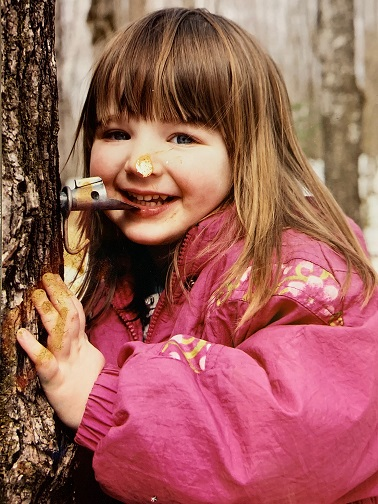

```{r global_options, include = FALSE}
knitr::opts_chunk$set(message=FALSE,
tidy.opts=list(width.cutoff=60))
```



<br>

## Randy's notes
* 1 Sept 21
    * added table of contents
    * added a theme...feel free to change!  See https://bootswatch.com/3/ for some options (there are always more!)
    * downloaded photo and changed name
    * changed header level from ### to ##
    * great idea putting in keywords and image!
    * added "More Ideas" section at the bottom

## Where I might want to work
1. Gunnison, Arapaho, and Roosevelt National or State Forests (or Colorado)
2. Northern Highland American Legion State Forest (or Northern Wisconsin)
3. Vermont National or State Forests or Adirondacks (or Vermont)

## Skills I want to learn
* How to make outstanding R plots
* Mapping in R
* More practice mapping in ArcGIS especially raster data sets

## What I want out of the internship experience
* To vastly improve my confidence using R and ArcGIS 
* To form connections in either USFS, USGS, USFWS, or state agencies in areas of interest above

## Keywords of my research interests
* Watersheds
* Ground water
* Macrophyte ranges especially Wild Rice _Zizainia palustris_ "Manoomin"
* Forest type ranges especially boreal forests
* Cedar, Ash, and other peatland or wetland distribution
* Mountain wetlands
* Fisheries
* Macroinvertebrates
* Forest fires
* Run off changes from forest fire caused canopy, duff, and organic matter removal

## More Ideas/thoughts

* work through *QGIS for Hydrological Applications* by Hans van der Kwast and Kurt Menke
* Randy contacts staff with The Nature Conservancy in Colorado, Vermont and Wisconsin for GIS/hydro work
* post fire erosion risk might be an option!  See https://www.fs.usda.gov/ccrc/tool/watershed-erosion-prediction-project-wepp
* at the least we should work through code by Myles Walimaa that reprojects, clips and does all sorts of cool things with [LANDFIRE](https://landfire.gov/) data.